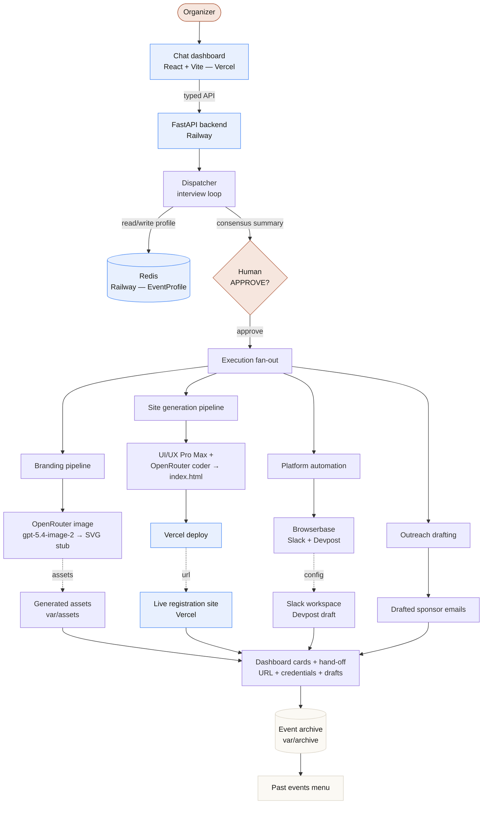

# Marquee — plan a whole event by chat

Marquee is a stateful, multi-agent event-planning orchestrator. An organizer
describes an event in a single chat conversation; the agent interviews them,
builds a structured event profile, pauses for approval, and then executes the
reversible build work autonomously — branded visual assets, a deployed
registration site, community Slack + Devpost setup, and drafted sponsor
outreach — collapsing weeks of cross-platform coordination into a few hours.

The build targets the **UC Berkeley AI Hackathon 2026** as its pilot event.

> Planning docs: [`PRD.md`](PRD.md) · [`spec.md`](spec.md) · [`PLAN.md`](PLAN.md)
> Repo: https://github.com/isaksmith/EventPlannerAgent

---

## What's in this repo

| Path | Stack | Role |
| --- | --- | --- |
| [`app/`](app) | React 18 + Vite 5 + Tailwind 3 + TypeScript | The planning dashboard — chat panel + live deliverable cards (brand, website, outreach, location) with mocked-integration seams. |
| [`backend/`](backend) | Python 3.11 + FastAPI + Redis + OpenTelemetry/Arize + FastMCP | The orchestration engine: dispatcher / interview loop, state machine, memory, integrations, webhooks, routes. See [`backend/README.md`](backend/README.md). |
| [`landing/`](landing) | Static HTML + committed scroll-hero frames | Standalone marketing landing page. Does **not** depend on `app/`; the only link is its "Try the Demo" button. See [`landing/README.md`](landing/README.md). |
| [`docs/superpowers/`](docs/superpowers) | Markdown | Narrative design + spec notes. |
| [`skills-lock.json`](skills-lock.json) | JSON | Pinned external skill manifests (Arize, etc.) used by the backend. |

The frontend talks to the backend over a typed API seam (`app/src/api/`); the
backend orchestrates real integrations and serves generated assets/sites.

---

## Architecture at a glance



The agent **calibrates autonomy to stakes**: it runs reversible, low-risk work on
its own and stops to hand control back to the human for decisions that carry real
money or relationships. Drafts are produced; the human sends.

---

## Quick start

The app is hosted — you can use it without running anything locally:

- **Dashboard:** https://app-rii5cmlei-isaksmiths-projects.vercel.app/
- **Backend API:** https://backend-production-d01d4.up.railway.app/health

To run locally for development:

### 1. Backend (FastAPI on `:8000`)

```bash
cd backend
python -m venv .venv
source .venv/bin/activate
pip install -e ".[dev]"
cp .env.example .env       # fill in the integrations you want
uvicorn app.main:app --reload --port 8000
```

Health check: `curl http://localhost:8000/health`

With Docker (Redis + backend together):

```bash
cd backend
docker compose up --build
```

Deployed backend (Railway): the `backend` service builds from
`backend/Dockerfile` (which honors Railway's `$PORT`), backed by a Railway-managed
Redis. Push env vars via `railway variables set --service backend …` and redeploy
with `railway up --service backend`.

The backend expects a Redis at `REDIS_URL` (default `redis://localhost:6379/0`).
The dashboard, asset, site, and webhook routers are mounted under
`/`, `/assets`, `/sites`, `/webhooks`, and the FastMCP server under `/mcp`.

### 2. Dashboard (Vite on `:5173`)

```bash
cd app
npm install
npm run dev
```

Open http://localhost:5173 — the dashboard proxies API calls to
`http://127.0.0.1:8000` in dev (see `app/vite.config.ts`). For the deployed
build, `VITE_API_BASE` points the frontend at the Railway backend.

**Demo mode** (default) drives a canned timeline with mocked integrations —
use **Next** and **Auto-play** to advance. The chat input is intentionally
disabled in Demo; switch to **Live** mode to talk to the real backend.
On mount, the first few demo steps auto-play so the welcome exchange is visible
immediately instead of starting from a blank chat.

### 3. Landing page (static, optional)

```bash
cd landing
python -m http.server 8750   # open http://localhost:8750/
```

Edit `PLATFORM_URL` near the top of the `<script>` in `landing/index.html`
to point its "Try the Demo" button at wherever the dashboard is served.

---

## Configuration

All runtime config is env-driven, read by `backend/app/config.py` (Pydantic
Settings) from `backend/.env`. See [`backend/.env.example`](backend/.env.example)
for the full list. Highlights:

**Core**
- `REDIS_URL` — state store.
- `APP_ENV`, `LOG_LEVEL`.
- `PUBLIC_BASE_URL` — public HTTPS base used for live site URLs in the SMS hand-off.

**Observability**
- `ARIZE_ENABLED`, `ARIZE_API_KEY`, `ARIZE_SPACE_ID`, `ARIZE_PROJECT_NAME` —
  real OpenTelemetry export when set; no-op otherwise.

**Creative / image generation**
- `OPENROUTER_API_KEY`, `OPENROUTER_IMAGE_ENABLED`, `OPENROUTER_IMAGE_MODEL`,
  `OPENROUTER_IMAGE_PRIMARY` — OpenRouter image generation (primary; currently
  `openai/gpt-5.4-image-2`). An `image-prompt-smith` skill (DeepSeek) refines
  the prompt before the image call. Local SVG stubs are the last resort when
  OpenRouter is disabled or fails.
- `MIDJOURNEY_MCP_*` — optional Midjourney MCP fallback for hero/brand assets.

**Site generation**
- `OPENROUTER_MODEL`, `SITE_CODER_ENABLED`, `UI_UX_PRO_MAX_ENABLED` — primary
  site generation via the **UI/UX Pro Max** skill guiding an OpenRouter coder
  that tool-calls the filesystem to write `index.html`.
- `OPENCODE_*` — optional OpenCode CLI fallback.
- `VERCEL_TOKEN`, `VERCEL_TEAM_ID` — deploy the generated site to Vercel and
  disable deployment protection so it's publicly reachable. Local `file://`
  URL is used when unset.

**Platform automation**
- `BROWSERBASE_*`, `DEVPOST_ENABLED` — headless automation for Slack workspace
  provisioning and Devpost draft setup.
- `SLACK_*` — pre-created workspace + OAuth token.
- `SUPABASE_URL`, `SUPABASE_SERVICE_ROLE_KEY` — registration persistence
  (a JSONL fallback is used when unset).

**Inbound**
- `POKE_API_KEY`, `POKE_WEBHOOK_SECRET`, `POKE_API_BASE_URL` — the SMS/iMessage
  webhook harness for the live interview loop.

---

## Project layout

```
.
├── app/                      # React dashboard
│   └── src/
│       ├── App.tsx           # layout, chat expand/collapse, demo auto-welcome
│       ├── components/       # Header, ChatPanel, Tiles, PastEvents, Icon, …
│       ├── orchestrator/     # demoScript, useOrchestrator, liveSync, useLiveOrchestrator
│       ├── lib/maps.ts       # keyless Google Maps helpers (dashboard + sites agree)
│       └── api/              # typed client to the FastAPI backend
├── backend/                  # FastAPI orchestration engine
│   ├── app/
│   │   ├── config.py         # env-driven Settings
│   │   ├── main.py           # app factory + routers
│   │   ├── orchestrator/     # dispatcher, state_machine, approval_gate, executor
│   │   ├── memory/           # redis_store + schema (EventProfile)
│   │   ├── integrations/     # browserbase, midjourney, openrouter_images,
│   │   │   #                    openrouter_auth, pika, slack, supabase,
│   │   │   #                    site_coder, site_template, site_generation,
│   │   │   #                    site_workspace, outreach, ui_ux_pro_max, vercel, …
│   │   ├── observability/    # arize OTel tracer
│   │   ├── routes/           # admin, assets, dashboard, sites
│   │   ├── templates/        # event_site/index.html
│   │   ├── mcp/              # FastMCP server
│   │   └── webhooks/         # poke
│   ├── tests/                # pytest, pytest-asyncio
│   ├── Dockerfile
│   ├── docker-compose.yml
│   ├── pyproject.toml
│   └── README.md
├── landing/                  # static marketing page + committed scroll-hero frames
├── docs/superpowers/         # design narrative
├── PRD.md                    # product requirements
├── spec.md                   # implementation spec
├── PLAN.md
└── skills-lock.json          # pinned external skills
```

---

## Running the tests

```bash
cd backend
pip install -e ".[dev]"
pytest                      # full suite
pytest tests/test_site_coder.py tests/test_openrouter_images.py -v
```

Some integration tests (e.g. `test_openrouter_images.py`,
`test_openrouter_auth.py`) call real external APIs and need network access plus
the relevant credentials in `.env` — run them with `pytest -m network` or
explicitly, not as part of CI sandboxes that block egress.

---

## How a run flows

1. **Initiation** — user opens the dashboard and chats (Demo or Live).
2. **Interview** — the dispatcher asks structured questions; every answer is written into the
   Redis `EventProfile` (`event`, `audience`, `aesthetic`, `ops`, `outreach`,
   `artifacts`).
3. **Consensus** — the agent posts a concise summary and pauses for `APPROVE`.
4. **Execution** — on approval the orchestrator fans out:
   - **Branding** — OpenRouter image (`openai/gpt-5.4-image-2`) / SVG fallback → hero,
     invite cover, logo lockup, palette. Surfaced in the dashboard **Brand** card
     with a loading state while generating.
   - **Website** — UI/UX Pro Max designs a system; the OpenRouter coder tool-calls
     `index.html` into being; Vercel deploys it; the **Website** card flips to a
     **View Live Site** button when `site_url` is set. A keyless Google Maps
     embed (`z=17`) is added when the location is physical.
   - **Outreach** — sponsor emails are drafted and shown in the **Outreach** card.
   - **Location** — a **Location** card with an embedded map + "Get directions"
     link appears when `event.location` is a real place (virtual/TBD are skipped).
5. **Handoff** — the live site URL, credentials, and drafts are returned to the
   user; the event is archived to `var/archive/` for the **Past events** menu
   before the session is cleared.

---

## Notes

- The dashboard and generated sites use the **same** keyless Google Maps helpers
  (`app/src/lib/maps.ts` mirrors `backend/app/integrations/site_template.py`) so
  a location resolves to the same place on both sides.
- Loading states are surfaced as skeletons/spinners in the Brand, Website, and
  Outreach cards rather than empty SVGs or filler text while work is in flight.
- The chat panel's top-right button expands the chat to full width and collapses
  back to the split dashboard view; placeholder cards are shown even with no data.
- The `.cursor/worktrees/EventPlannerAgent/milestone-1` directory is a git worktree
  used for milestone-scoped work; the canonical checkout is the project root above.

---

## License

Hackathon project for UC Berkeley AI Hackathon 2026. See the planning docs above
for status and contributors.
